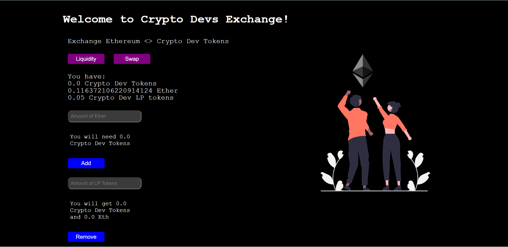

# Decentrlized-Exchange-Uniswap-Eth-CD-Pair

This is a Dex that exhibits the Good understanding of 
  
  - Blockchain Fundamentals 
  - Advanced solidity topics 
  - Decentralized Exchanges.

This is a  Decentralized platform where any CryptoDev NFT Holder ( hold through my previous DAPP- Initial Coin Offering )
can 

  - Add liquidity to the Dex
  - Claim Liquidity tokens with ether as reward
  - Swap Ethereum Balance with CryptoDev Tokens
  

### Precation
    
    Don't use your Mainnet Wallet Account
    Use Goerli Test Network
    Make sure to mint some NFTs from my Market place Dapp before continuing
    

###  Concepts Involved

    - Solidity    
            OpenZeppelin
            ERC721 Emuerable 
            Ownable
            Custom Smart contracts 
            Receiving Ether
            Mapping
            Payable Function
            Pure Function
            View Functions

    - NextJs
            Api Routing
            CSS Modules
            Use Hooks
            State management
            Conditional Rendering
            Async functions
            Timed Functions
      
    - Ethers.js
            Provider
            Signer
            Utils
            call transactions
      
    - Web3Modal
            Metamask Connection
            Web3Modal Provider

    

It illustrates how you can achieve decentralized governance.

##### Short Comings

    Right Now Dex deals with only one Token 'CryptoDev' , but it can be extended in the long way
        
#### Deployment Network
    Ethereum Goerli    

### Deployment Link
https://cd-dex-umaresso.vercel.app/

